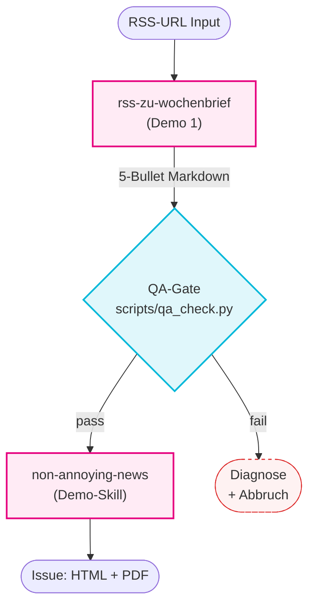

# `daily-briefing` Composer — Pipeline

## Mermaid-Diagramm

## Datenfluss

| Stage | Input | Output | Verantwortlich |
|---|---|---|---|
| 1 | RSS- / Atom-URL | 5-Bullet Markdown | Demo 1: `rss-zu-wochenbrief` |
| 2 | Markdown-Datei | JSON-Report + Exit-Code | `scripts/qa_check.py` (dieser Skill) |
| 3 | Markdown (pass) | Issue: HTML + PDF | `non-annoying-news` |

## QA-Failure-Verhalten

Bei `passed: false`:

1. JSON-Report ungekürzt im Chat anzeigen.
2. **Keinen** `non-annoying-news`-Aufruf machen.
3. Den Nutzer fragen: Rerun mit anderer URL? Manueller Fix? QA-Regeln in `references/qa-gate.md` anpassen?

## Schichten der AgentSkills-Spec in diesem Composer

- `SKILL.md` — Manifest + 5-Schritte-Workflow (das Composing).
- `references/qa-gate.md` — Lazy-loaded Spec der Quality-Checks.
- `scripts/qa_check.py` — ausführbarer Validator (stdlib-only).
- `assets/composition-diagram.md` — dieses Diagramm.

Genau die vier Schichten der [AgentSkills-Spec](https://agentskills.io) — Composer haben keine Sonderform.
